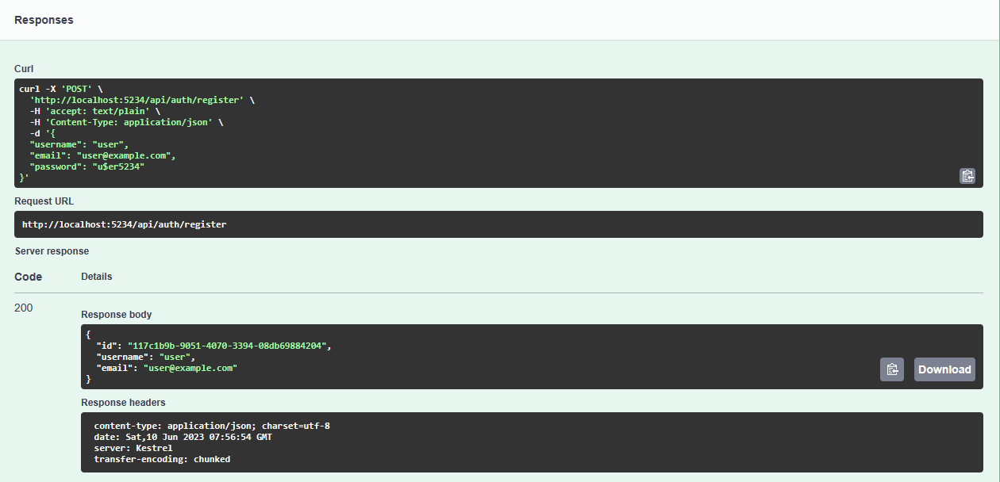
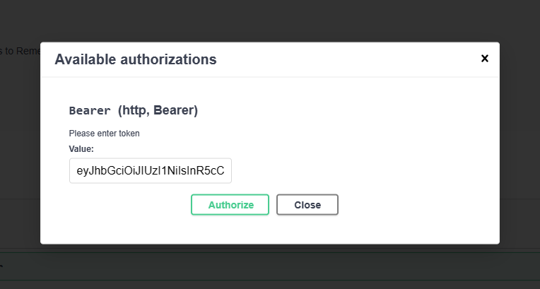
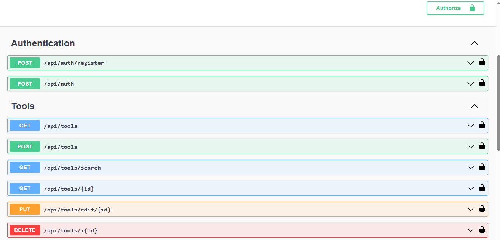

# vuttr-api

This is an API for the **VUTTR (Very Useful Tools to Remember)** application. The application is a simple repository for managing tools with their respective names, links, descriptions and tags.

### Features

-   User Registration
-   Password Hashing
-   JWT Authentication
-   Authorization

### Frameworks and Libraries

The API uses the following libraries and frameworks to deliver the functionalities described above:

-   .NET 7
-   Entity Framework Core 7.0.5 (with MS SQL)
-   AutoMapper

### How to test

I added Swagger UI to the API, so we can use it to visualize and test all API routes. You can run the application and navigate to `/swagger` to see the API documentation:


Clone this repository and open it in a terminal.

```
$ git clone https://github.com/mk-milly02/vuttr-api.git
```

Add `appsettings.json` to the presentation layer with a connection string and jwt settings.

`$ cd vuttr-api/src/vuttr-api.presentation`

```
"ConnectionStrings": {
	"vuttr-api-database": "Server=....."
},
"JwtSettings": {
	"validIssuer": "{issuer}",
	"validAudience": "{audience}",
	"secretKey": "{key}"
}
```

Then restore all the dependencies and run the project.

```
$ dotnet restore
$ dotnet run
```

**Creating users**

To create a user, make a POST request to http://localhost:5234/api/auth/register specifying a username, a valid e-mail and password.

```
{
    "username": "user",
    "email": "user@example.com",
    "password": "u$eR5234"
}
```



**Requesting access token**

To request the access token, make a POST request to http://localhost:5234/api/auth sending a JSON object with user credentials. The response will be a JSON object with:

-   An access token which can be used to access protected API endpoints;
-   A datetime value that represents the expiration date of the token.

Access token expires after 15 minutes (you can change this in AuthService.cs - `GenerateTokenOptions`).


**Accessing protected endpoints**

There are six API endpoints that you can test:

| Action | Url                                           |
| ------ | --------------------------------------------- |
| GET    | http://localhost:5234/api/tools               |
| GET    | http://localhost:5234/api/tools/search?tag="" |
| GET    | http://localhost:5234/api/tools/{id}          |
| POST   | http://localhost:5234/api/tools               |
| PUT    | http://localhost:5234/api/tools/edit/{id}     |
| DELETE | http://localhost:5234/api/tools/:{id}         |

With a valid access token in hands, paste it after clicking the `Authorize' button.



All endpoints should be accessible after that



### Contributing

Contributions are welcome! If you have any suggestions, bug reports, or feature requests, please open an issue or submit a pull request.

### License

This project is licensed under the MIT License. See the `LICENSE` file for details.
